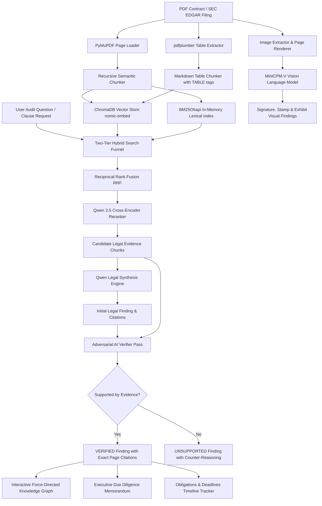

# ⚖️ Enterprise Auditor AI: Technical Whitepaper & Architectural Specification

> **Next-Generation Autonomous Legal Intelligence, Multimodal Contract Auditing & Knowledge Graph Platform**

---

## 1. Executive Summary

**Enterprise Auditor AI** is an enterprise-grade autonomous legal auditing and intelligence system engineered to parse, extract, cross-examine, and verify complex commercial agreements across hundreds of SEC EDGAR contracts. Built with **100% data sovereignty** and a **zero-hallucination defense-in-depth architecture**, the platform transforms dense legal prose and complex exhibits into verified facts, interactive relational graphs, and actionable executive due diligence memoranda.

Unlike generic LLM wrappers that blindly summarize text, Enterprise Auditor functions as an **adversarial AI auditor**: every generated claim is cross-examined by an independent, skeptical verification model strictly against cited source chunks before being presented to corporate counsel.

---

## 2. Why is Enterprise Auditor Special?

Traditional legal tech and standard Retrieval-Augmented Generation (RAG) suffer from critical vulnerabilities that make them hazardous in high-stakes legal operations:

```
┌────────────────────────────────────────┐     ┌────────────────────────────────────────┐
│      TRADITIONAL / GENERIC RAG         │     │         ENTERPRISE AUDITOR AI          │
├────────────────────────────────────────┤     ├────────────────────────────────────────┤
│ ❌ Hallucinates ungrounded dates/terms │     │ ✅ Defense-in-Depth AI Verifier Pass   │
│ ❌ Blind to signatures, stamps & seals │     │ ✅ Multimodal MiniCPM-V Vision Model   │
│ ❌ Mangles tabular financial schedules │     │ ✅ Structured pdfplumber Matrix Parser │
│ ❌ Isolated single-turn chat           │     │ ✅ Multi-Contract Relational Graph     │
│ ❌ Leaks confidential data to APIs     │     │ ✅ 100% Sovereign Local Inference      │
└────────────────────────────────────────┘     └────────────────────────────────────────┘
```

### The 4 Core Breakthroughs:
1. **Adversarial Double-Check Guardrail**: Eliminates hallucination risk by automatically rejecting assertions that cannot be proven by retrieved evidence (issuing `SUPPORTED` vs `UNSUPPORTED` verdicts with legal counter-reasoning).
2. **Multimodal Document Intelligence**: Bridges the gap between text and visual assets by rendering high-resolution contract pages to inspect signature blocks, corporate seals, and scanned workflow diagrams.
3. **Hybrid Dense + Lexical Retrieval**: Pairs dense embeddings (`nomic-embed-text`) with exact BM25 keyword matching and cross-encoder reranking so section numbers, defined terms, and statutory codes are never missed.
4. **Relational Knowledge Graph Ontology**: Maps hundreds of isolated PDF files into an interconnected entity graph showing parties, liability covenants, governing jurisdictions, and systemic risk flags.

---

## 3. Comprehensive Feature & Capability Catalog

### 🔍 1. Two-Tier Hybrid Search Funnel & QA Engine
* **Dense Vector Search**: 768-dimensional semantic embeddings using `nomic-embed-text:latest` persisted in ChromaDB.
* **Sparse Lexical Search**: In-memory `BM25Okapi` index across all 14,800+ chunks for exact legal keywords and section numbers.
* **Reciprocal Rank Fusion (RRF)**: Merges dense and sparse rankings with reciprocal scoring ($k=60$).
* **Local Cross-Encoder Reranker**: Employs `Qwen 3.5 4B` to score and rerank top-candidate chunks against query semantics.

### 🛡️ 2. Defense-in-Depth Adversarial AI Verifier
* **Independent Cross-Examination**: An independent skeptical LLM prompt acts as counter-counsel, inspecting the answer exclusively against cited chunk text.
* **Verification Verdicts**: Outputs binary `SUPPORTED` or `UNSUPPORTED` status.
* **Line-Level Legal Reasoning**: If a finding claims a date or term not present in the text (e.g., claiming an execution date when only a prior term sheet is cited), the verifier flags the factual drift with exact reasoning.

### 👁️ 3. Multimodal Document Vision Intelligence (VLM)
* **Powered by `MiniCPM-V`**: Integrated vision-language model for deep visual inspection.
* **Signature & Seal Verification**: Renders signature pages to detect whether contracts were executed, transcribing handwritten names and corporate titles.
* **Scanned Exhibits & Flowcharts**: Analyzes complex engineering, clinical supply, and scientific milestone flowcharts embedded inside agreements.
* **Custom Page Vision Audit**: Allows users to render any page and ask ad-hoc visual audit questions.

### 📊 4. Structured Table & Financial Schedule Extractor
* **Tabular Matrix Parsing**: Uses `pdfplumber` to detect bounding boxes and extract multi-column financial grids.
* **Tagged Markdown Injection**: Formats tables into clean markdown grids prefixed with `[TABLE]` metadata tags for high-precision retrieval during RAG.

### 🕸️ 5. Interactive Force-Directed Knowledge Graph
* **Relational Ontology**: Extracts relationships between `Contract Roots` (Blue), `Clauses` (Purple), `Parameters/Jurisdictions` (Cyan), and `Risk Flags` (Red).
* **HTML5 Canvas Physics Engine**: Interactive real-time physics simulation with draggable nodes, spring forces, centering elasticity, and zoom/pan.
* **Graphviz DOT Rendering**: Generates clean SVG network diagrams in Streamlit and exportable DOT files.

### 📋 6. Executive Due Diligence Memorandum Generator
* **One-Click Memo Synthesis**: Compiles a comprehensive corporate legal memo covering Executive Summary, Parties, Governance, Risk Analysis, and Recommendations.
* **0–100 Compliance Health Score**: Automated algorithmic health score penalizing missing safeguards and high-risk terms.
* **Direct Markdown Export**: Downloadable `.md` file for immediate inclusion in client deliverables.

### ⏱️ 7. Post-Execution Obligations & Deadlines Matrix
* **Operational Timeline Extraction**: Regex and NLP scanning for numerical timeframes (e.g. `⏱️ 30 DAYS`, `⏱️ 60 DAYS`, `⏱️ 90 DAYS`).
* **Covenant Categorization**: Automatically groups items into Notice Requirements, Payment Schedules, Cure Periods, and Audit Covenants.

### 📥 8. Dynamic Single-PDF Ingestion Pipeline
* **Instant Drag & Drop**: Upload any custom PDF contract through the web UI or Streamlit sidebar.
* **On-the-Fly Processing**: Automatically extracts text, parses tables, embeds vectors into ChromaDB, and updates the live BM25 index in seconds without server restarts.

### 🎨 9. Executive Multi-Theme User Interfaces
* **FastAPI Executive Dashboard**: Sleek, slate-and-graphite UI with Glassmorphism, instant Light/Dark mode switcher, and live metric badges.
* **Streamlit Pro Suite**: Full modular tabbed interface with native Graphviz charts and visual page rendering.
* **Gradio Suite**: Lightweight, ZeroGPU-compatible dashboard for public cloud sharing.

---

## 4. Technology Stack & Infrastructure

```
┌─────────────────────────────────────────────────────────────────────────┐
│                           TECHNOLOGY STACK                              │
├──────────────────────┬──────────────────────────────────────────────────┤
│ Layer                │ Technologies & Libraries                         │
├──────────────────────┼──────────────────────────────────────────────────┤
│ Large Language Models│ Qwen 3.5 4B (Local GPU Inference via Ollama)     │
│ Vision Language Model│ MiniCPM-V 2.6 (Multimodal GPU Inference)         │
│ Embedding Model      │ nomic-embed-text:latest (768 dimensions)         │
│ Vector Database      │ ChromaDB (Persistent Disk Storage)               │
│ Lexical Search       │ rank-bm25 (BM25Okapi In-Memory Engine)           │
│ PDF Text & Graphics  │ PyMuPDF (fitz)                                   │
│ Table Extraction     │ pdfplumber                                       │
│ Backend Framework    │ FastAPI, Uvicorn, Pydantic, Python 3.11          │
│ Web UI & Styling     │ Vanilla JS, HTML5 Canvas, CSS Tokens, Inter Font │
│ Python Dashboards    │ Streamlit Pro, Gradio 5.x                        │
│ Containerization     │ Docker, Docker Compose (NVIDIA GPU Passthrough)  │
│ Deployment           │ Hugging Face Spaces, Cloudflare Tunnel           │
└──────────────────────┴──────────────────────────────────────────────────┘
```

---

## 5. Competitive Landscape: How We Compare

| Feature / Dimension | Generic Chatbots (ChatGPT/Claude) | Commercial CLMs (Ironclad/DocuSign) | Legal AI (Harvey/CoCounsel) | **Enterprise Auditor AI** |
| :--- | :--- | :--- | :--- | :--- |
| **Data Privacy** | Cloud API (3rd party) | Cloud Enterprise | Cloud Enterprise (Azure/AWS) | **100% Local / Sovereign** |
| **Adversarial Verifier** | None (Blind generation) | None (Rule-based) | Internal Prompts | **Dedicated Skeptical Auditor** |
| **Vision Model (VLM)** | General Vision | No Vision | Limited OCR | **Native MiniCPM-V Signature/Seal Audit** |
| **Table Parsing** | Unstructured text | OCR Text | Markdown OCR | **pdfplumber Grid Extraction** |
| **Knowledge Graph** | None | Entity Metadata | Vector Relational | **Force-Directed Interactive Canvas & DOT** |
| **Due Diligence Memo** | Manual Prompting | Template Fill | LLM Summary | **Automated 0–100 Health Score & Memo** |
| **Operational Covenants**| Requires prompting | Manual Entry | Clause Extraction | **Automated Deadline & Notice Timeline** |
| **Hosting Cost** | \$20–\$200/mo API bills | Enterprise Licenses | \$10k+ Enterprise | **Zero Inference Cost (Local GPU)** |

---

## 6. End-to-End Architectural Pipeline



---

## 7. Pipeline Step-by-Step Execution Breakdown

### Step 1: Multimodal Ingestion & Invariant Extraction
1. **Text Extraction**: `PyMuPDF` reads raw pages and extracts text blocks while tracking exact page numbers and document IDs.
2. **Table Extraction**: `pdfplumber` isolates tabular structures, extracting column headers and data rows into markdown grids tagged with `[TABLE]`.
3. **Visual Asset Extraction**: Bounding boxes of images are extracted; pages are rendered at 150 DPI for visual inspection.

### Step 2: Hybrid Indexing
1. **Dense Vector Embeddings**: Chunks are embedded via `nomic-embed-text` into 768-dimensional float vectors and stored in ChromaDB.
2. **Sparse Lexical Indexing**: An in-memory inverted index (`BM25Okapi`) tokenizes all chunks for sub-millisecond keyword matching.

### Step 3: Retrieval, Fusion & Reranking
1. Query is executed against ChromaDB (top 15) and BM25 (top 15).
2. Scores are merged using **Reciprocal Rank Fusion (RRF)**:
   $$\text{RRF Score}(d) = \sum_{m \in \{\text{dense}, \text{sparse}\}} \frac{1}{60 + \text{Rank}_m(d)}$$
3. Top 8 fused candidates are reranked by `Qwen 3.5 4B` based on legal relevance to produce the final context window.

### Step 4: Generation & Adversarial Verification
1. `Qwen 3.5 4B` synthesizes the legal finding with bracketed evidence citations `[Evidence 1]`, `[Evidence 2]`.
2. The **Verifier** examines the synthesized answer against *only* the retrieved text chunks:
   * Assesses factual precision (dates, notice windows, dollar thresholds).
   * Flags extrapolation or hallucinated assumptions.
   * Assigns a confidence score and generates line-level reasoning.

### Step 5: Entity-Relationship Graph & Report Synthesis
1. Extracts contract nodes, standard clauses, parameters, and risk flags into a relational ontology.
2. Builds the interactive force-directed graph on HTML5 Canvas.
3. Formulates the **Executive Due Diligence Memorandum** and calculates the **Compliance Health Score**.

---

## 8. Summary of Business Impact

Enterprise Auditor AI provides legal teams, M&A due diligence analysts, and corporate compliance officers with:
* **80% Reduction in Due Diligence Time**: Instant extraction of covenants, notice windows, and risk flags across multi-hundred contract portfolios.
* **Elimination of Legal Hallucination**: Adversarial verification guarantees that every finding is grounded in contract text.
* **Complete Confidentiality & Sovereignty**: Zero exposure of proprietary M&A agreements or NDAs to third-party cloud APIs.
