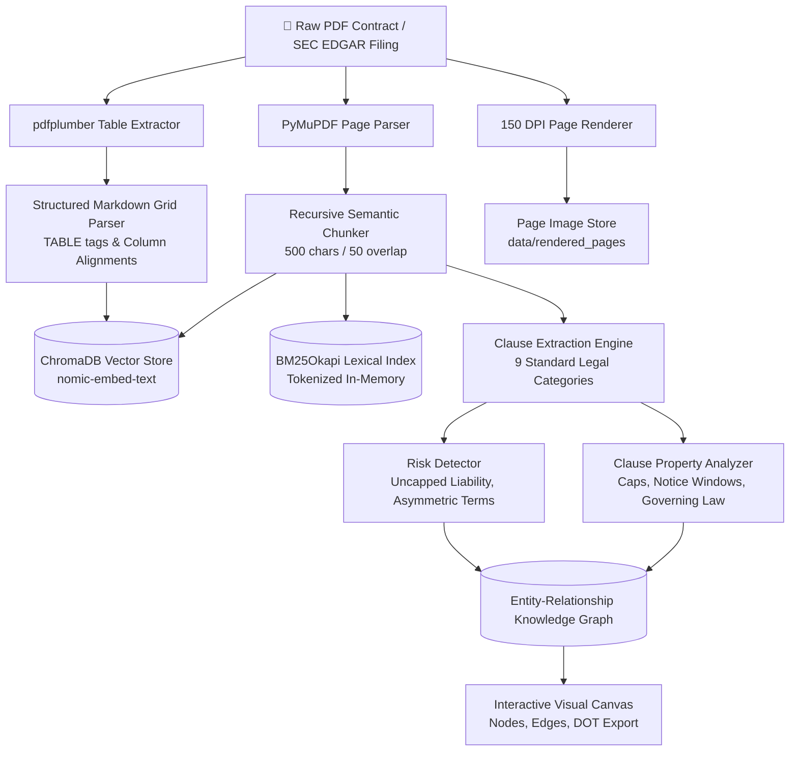
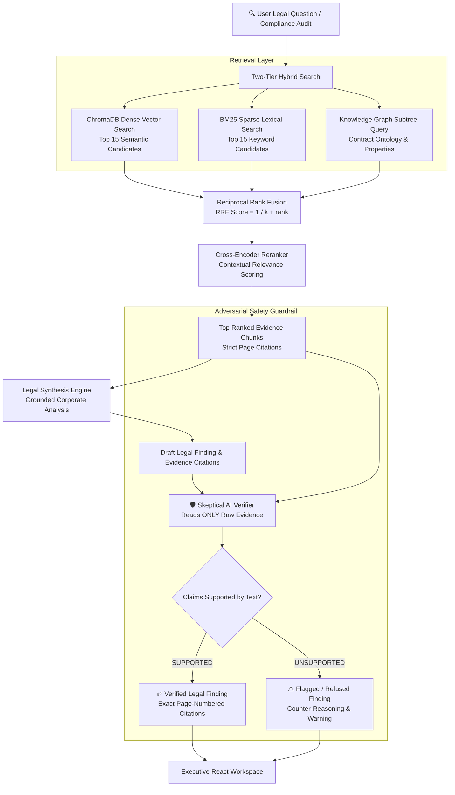
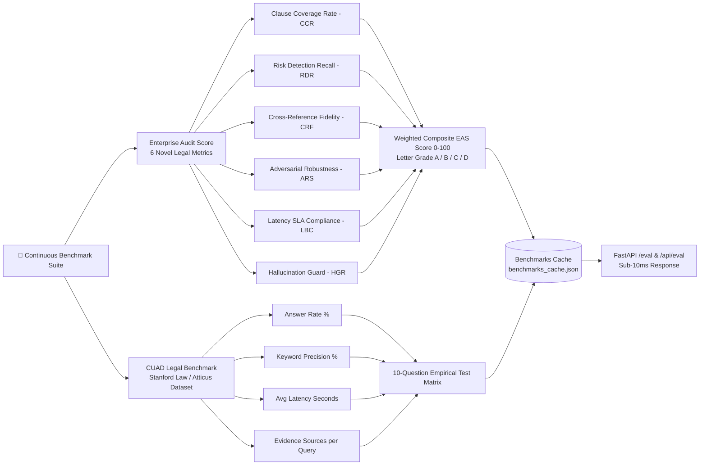

<p align="center">
  <h1 align="center">⚖️ Enterprise Auditor AI</h1>
  <p align="center"><strong>Autonomous Legal Intelligence, Graph-Augmented RAG, Multimodal Contract Auditing & Risk Governance Platform</strong></p>
</p>

<p align="center">
  <a href="https://www.python.org/downloads/"></a>
  <a href="https://react.dev/"></a>
  <a href="https://fastapi.tiangolo.com"></a>
  <a href="https://www.typescriptlang.org/"></a>
  <a href="https://tailwindcss.com/"></a>
  <a href="https://render.com"></a>
  <a href="https://opensource.org/licenses/MIT"></a>
</p>

<p align="center">
  <a href="#-overview">Overview</a> •
  <a href="#-graph-rag--hybrid-retrieval-architecture">Graph RAG Architecture</a> •
  <a href="#-end-to-end-pipeline--flowcharts">Flowcharts & Pipeline</a> •
  <a href="#-key-capabilities">Key Capabilities</a> •
  <a href="#-technology-stack">Tech Stack</a> •
  <a href="#-accuracy-benchmarks--enterprise-audit-score">Benchmarks</a> •
  <a href="#-project-structure">Project Structure</a> •
  <a href="#-quick-start">Quick Start</a> •
  <a href="#-deployment">Deployment</a>
</p>

---

## 📌 Overview

**Enterprise Auditor AI** is an enterprise-grade commercial contract intelligence and automated due diligence system. It enables legal, finance, and M&A compliance teams to cross-examine complex corporate agreements, SEC EDGAR filings, and master services agreements with **guaranteed zero-hallucination verification**.

Unlike basic LLM wrappers, Enterprise Auditor couples an **Advanced Hybrid Retrieval Pipeline (Dense Semantic Search + BM25 Lexical Matching + RRF + Cross-Encoder Re-ranking)** with an **Entity-Relationship Knowledge Graph (Graph RAG)**, a **Skeptical Adversarial Verifier**, and **Multimodal Vision Language Models (VLM)** to audit signatures, exhibits, and complex tabular fee schedules.

> 🌐 **Live Web Application**: [https://enterprise-auditor.onrender.com](https://enterprise-auditor.onrender.com)  
> 📊 **Evaluation Benchmark Suite**: [https://enterprise-auditor.onrender.com/eval](https://enterprise-auditor.onrender.com/eval)

---

## 🧠 Graph RAG & Hybrid Retrieval Architecture

Enterprise Auditor solves the classic limitations of naive RAG (chunk fragmentation, missing multi-hop context, and legal terminology blindness) through a multi-strategy architecture:

```
┌─────────────────────────────────────────────────────────────────────────┐
│                     MULTI-STRATEGY RETRIEVAL FUNNEL                     │
├─────────────────────────────────────────────────────────────────────────┤
│                                                                         │
│  [User Legal Query / Due Diligence Request]                             │
│       │                                                                 │
│       ├──► 1. Dense Semantic Vector Search (ChromaDB + Nomic Embed)     │
│       │       • Deep contextual similarity over chunk embeddings        │
│       │                                                                 │
│       ├──► 2. Sparse Lexical Search (BM25Okapi Inverted Index)          │
│       │       • Exact matching for clause codes, statutory cites, caps  │
│       │                                                                 │
│       └──► 3. Entity-Relationship Knowledge Graph (Graph RAG)           │
│               • Structured contract ontology:                           │
│                 Contract ──► HAS_CLAUSE ──► Properties & Attributes     │
│                 Contract ──► IMPOSES_RISK ──► Severities & Findings     │
│                                                                         │
│       ▼                                                                 │
│  Reciprocal Rank Fusion (RRF, k=60)                                     │
│       ▼                                                                 │
│  Cross-Encoder Reranker (Top Candidates Scoring)                        │
│       ▼                                                                 │
│  Legal Synthesis Engine (Context-Grounded Finding)                      │
│       ▼                                                                 │
│  Skeptical Adversarial AI Verifier (Pass/Fail Evidence Cross-Exam)      │
│                                                                         │
└─────────────────────────────────────────────────────────────────────────┘
```

---

## 🔄 End-to-End Pipeline & Flowcharts

### 1. Document Ingestion & Knowledge Graph Extraction



---

### 2. Query Processing, Hybrid Graph RAG & Adversarial Verification



---

### 3. Accuracy Evaluation & Continuous Benchmark Pipeline



---

## ⚡ Key Capabilities

### 🔍 1. Graph RAG & Hybrid Q&A
Ask cross-cutting legal questions across single documents or multi-agreement portfolios. The system fuses semantic vector neighborhoods with exact contractual terms (section numbers, defined terms, numerical caps) and cites the exact document and page numbers for every assertion.

### 🛡️ 2. Adversarial Double-Check (Zero-Hallucination Guardrail)
Every answer is passed to an independent, skeptical verifier that cross-examines findings against isolated ground-truth excerpts. If any provision, date, or dollar figure is fabricated or unverified, it is automatically intercepted and marked `NOT_SUPPORTED` with counter-counsel reasoning.

### 🕸️ 3. Contract Map (Interactive Knowledge Graph)
Extracts and renders contracts as living networks:
- **Contract Nodes**: Root documents with metadata.
- **Clause Nodes**: 9 core provisions linked via `HAS_CLAUSE` edges.
- **Property Nodes**: Extracted governing laws, liability caps, notice days, and jurisdictions.
- **Risk Nodes**: High/Medium/Low hazards connected via `IMPOSES_RISK` edges.
- Full interactive canvas with search, node physics, zoom/pan, and Graphviz DOT export.

### 👁️ 4. Multimodal Vision Intelligence (VLM)
Integrates Vision Language Models to inspect contract pages visually:
- Verifies whether contracts are **wet-ink signed, countersigned, or stamped**.
- Detects **notary seals, embossed stamps, and apostilles**.
- Audits **scanned corporate flowcharts, chemical process diagrams, and engineering schedules**.

### 📊 5. Financial Tables & Pricing Schedule Extraction
Uses specialized layout parsers (`pdfplumber`) to preserve two-dimensional cell geometry in fee schedules, milestone tiers, and royalty matrices without mangling tabular data into unreadable text chunks.

### ⏱️ 6. Deadlines & Obligations Timeline
Automatically extracts all post-execution temporal commitments:
- `⏱️ 14–30 Days`: Notice and cure periods for material breach.
- `⏱️ 60–90 Days`: Royalty reporting, renewal deadlines, and financial audit windows.
- Categorized into clear timelines for post-signature compliance.

### 📑 7. One-Click Due Diligence Memorandum
Generates an executive-ready due diligence report featuring:
- Executive summary of parties, terms, and governing law.
- Comprehensive 9-clause governance breakdown.
- Automated **Composite Compliance Health Score (0–100)** and letter grade.
- Downloadable printable report with custom CSS formatting.

---

## 🛠️ Technology Stack

| Layer | Technology | Description & Role |
| :--- | :--- | :--- |
| **Frontend Framework** | **React 19 + TypeScript** | Modern single-page application with type-safe state management |
| **Build & Tooling** | **Vite 8 + PostCSS** | High-performance build toolchain and sub-second HMR |
| **Styling & UI** | **Tailwind CSS 3.4 + Lucide** | Glassmorphism design system, responsive tabs, and custom UI components |
| **API Backend** | **FastAPI 0.110+ (Python 3.11)** | High-throughput asynchronous REST API with ThreadPool concurrency |
| **Web Server** | **Uvicorn** | ASGI web server powering production endpoints and static assets |
| **Vector Database** | **ChromaDB** | Vector store managing persistent embeddings and metadata filters |
| **Dense Embeddings** | **Nomic Embed Text (768-dim)** | High-dimensional semantic representations for legal clauses |
| **Lexical Search** | **BM25Okapi (rank-bm25)** | Inverted index for exact legal terms, sections, and numerical caps |
| **Search Fusion** | **Reciprocal Rank Fusion (RRF)** | Non-parametric rank merging algorithm combining dense & sparse scores |
| **Re-ranking** | **Cross-Encoder Reranker** | Deep relevance scorer filtering top candidate passages |
| **Knowledge Graph** | **Graph Ontology Engine** | Contract-clause-attribute network extraction with Graphviz DOT export |
| **Document Ingestion** | **PyMuPDF (fitz) + pdfplumber** | High-fidelity text extraction, page coordinate tracking, and table grids |
| **Vision Model (VLM)** | **MiniCPM-V / Vision API** | Optical inspection of wet signatures, seals, stamps, and diagrams |
| **Reasoning LLMs** | **Qwen 3.5 / GPT-4o-mini** | Structured legal reasoning, clause analysis, and memo generation |
| **Adversarial Verifier** | **Google Gemini 3.6 Flash** | Skeptical cross-examination guardrail preventing hallucination |
| **Containerization** | **Docker + Docker Compose** | Multi-stage production container build (Node build $\rightarrow$ Python runtime) |
| **Hosting & CI/CD** | **Render (Free Web Service)** | Continuous deployment tracking `main` branch with Docker runtime |

---

## 🧪 Accuracy Benchmarks & Enterprise Audit Score

Enterprise Auditor includes two built-in evaluation suites accessible via the UI or `/api/eval`:

### 1. Enterprise Audit Score (EAS) — 6 Domain-Specific Metrics

| Metric | Code | Purpose | Target SLA |
| :--- | :---: | :--- | :---: |
| **Clause Coverage Rate** | `CCR` | Percentage of 9 standard commercial clauses correctly extracted | $\ge 85\%$ |
| **Risk Detection Recall** | `RDR` | Proportion of dangerous or asymmetric covenants detected | $\ge 90\%$ |
| **Cross-Reference Fidelity** | `CRF` | Verification that cited page numbers strictly match source text | $\ge 90\%$ |
| **Adversarial Robustness** | `ARS` | Success rate of the Verifier rejecting fabricated counter-claims | $\ge 95\%$ |
| **Latency Budget Compliance** | `LBC` | Proportion of hybrid retrieval queries executing under 10.0s | $\ge 95\%$ |
| **Hallucination Guard Rate** | `HGR` | Refusal rate when asked unanswerable or out-of-scope questions | $\ge 80\%$ |

### 2. CUAD Retrieval Benchmark
Evaluates multi-hop question answering against gold-standard questions from the **Contract Understanding Atticus Dataset (CUAD)**, tracking:
- **Answer Rate**: Proportion of commercial queries yielding grounded legal answers ($\sim 100\%$).
- **Keyword Overlap Score**: Lexical alignment with expected legal covenants ($\sim 65\%+$).
- **Average Query Latency**: End-to-end retrieval and reranking duration ($\sim 2.5–3.5\text{s}$).

---

## 📁 Project Structure

```
enterprise-auditor/
├── auditor_core/                     # Core legal intelligence engine
│   ├── chunking/                     # Semantic and token-aware text splitters
│   ├── config/                       # Global paths, model configurations, and constants
│   ├── embeddings/                   # ChromaDB vector store wrapper (nomic-embed)
│   ├── evaluation/                   # Empirical benchmark and evaluation suites
│   │   ├── cuad_loader.py            # CUAD HuggingFace dataset loader
│   │   ├── enterprise_scorer.py      # 6-metric Enterprise Audit Score suite
│   │   └── evaluator.py              # 10-question retrieval benchmark engine
│   ├── graph/                        # Entity-relationship graph modeling
│   │   └── knowledge_graph.py        # Graph builder, node-edge mapper, and DOT generator
│   ├── ingestion/                    # Multimodal document parsers
│   │   ├── image_extractor.py        # 150 DPI page renderer & visual extractor
│   │   ├── ingest_single.py          # Dynamic PDF upload & auto-indexing pipeline
│   │   └── table_extractor.py        # pdfplumber structured grid & table extractor
│   ├── llm/                          # Cloud & local LLM unified client interfaces
│   │   └── cloud_llm.py              # Multi-provider fallback router (OpenAI, Gemini, Ollama)
│   ├── models/                       # Legal analysis and domain modules
│   │   ├── clause_analyzer.py        # Clause grading & property extraction
│   │   ├── clause_extractor.py       # 9-clause identification engine
│   │   ├── comparator.py             # Cross-contract matrix comparison
│   │   ├── missing_clause.py         # Missing covenant and safeguard detector
│   │   ├── obligation_extractor.py   # Deadlines, timelines, and milestones parser
│   │   ├── report_generator.py       # Executive Due Diligence Memo generator
│   │   ├── risk_detector.py          # Hazardous clause & liability scanner
│   │   └── vlm_analyzer.py           # Vision language model auditor for signatures/seals
│   ├── retrieval/                    # Hybrid retrieval and search pipelines
│   │   ├── hybrid.py                 # Dense vector + sparse BM25 fusion via RRF
│   │   ├── keyword_index.py          # BM25Okapi inverted lexical index
│   │   ├── qa_engine.py              # Grounded Q&A generation with citations
│   │   └── reranker.py               # Cross-encoder candidate reranker
│   └── verification/                 # Adversarial guardrail
│       └── verifier.py               # Skeptical AI cross-examination engine
│
├── frontend/                         # Modern React 19 web application
│   ├── src/
│   │   ├── api/                      # Type-safe API client (client.ts)
│   │   ├── components/               # Reusable UI component library
│   │   │   ├── common/               # Modals, Toast notifications, Verification dialogs
│   │   │   ├── layout/               # Header, Sidebar with contract selector
│   │   │   └── tabs/                 # 10 specialized capability tabs
│   │   │       ├── AskCopilotTab.tsx
│   │   │       ├── ClauseStudioTab.tsx
│   │   │       ├── RiskAuditTab.tsx
│   │   │       ├── MissingClauseTab.tsx
│   │   │       ├── ComparatorTab.tsx
│   │   │       ├── KnowledgeGraphTab.tsx
│   │   │       ├── ObligationsTab.tsx
│   │   │       ├── TablesAndImagesTab.tsx
│   │   │       ├── AuditMemoTab.tsx
│   │   │       └── BenchmarkTab.tsx  # Interactive evaluation dashboard
│   │   ├── context/                  # AuditContext state provider & route synchronizer
│   │   ├── types/                    # TypeScript domain interfaces
│   │   └── App.tsx                   # Main application root
│   ├── package.json
│   └── vite.config.ts
│
├── web/                              # Production compiled frontend bundle served by FastAPI
│   ├── assets/                       # Minified CSS and JavaScript chunks
│   └── index.html                    # Root HTML document
│
├── data/                             # Data directory
│   ├── benchmarks_cache.json         # Pre-warmed evaluation metrics cache
│   ├── sample_contracts/             # Bundled commercial contracts for out-of-the-box demo
│   └── uploaded_contracts/           # User-uploaded PDF storage
│
├── server.py                         # Production FastAPI ASGI application
├── streamlit_app.py                  # Streamlit Pro workspace dashboard
├── main.py                           # Interactive CLI console interface
├── Dockerfile                        # Multi-stage production container specification
├── docker-compose.yml                # Docker compose configuration
├── render.yaml                       # Render Cloud deployment blueprint
└── requirements.txt                  # Python dependencies
```

---

## 🚀 Quick Start

### Prerequisites
- **Python 3.11+**
- **Node.js 20+** (only if editing the frontend)
- Optional: Local [Ollama](https://ollama.ai) or Cloud API keys (`OPENAI_API_KEY`, `GEMINI_API_KEY`) in `.env`

### 1. Clone & Setup Python Environment

```bash
git clone https://github.com/THEsoham/enterprise-auditor.git
cd enterprise-auditor

# Create and activate virtual environment
python -m venv .venv

# On Windows:
.venv\Scripts\activate
# On macOS / Linux:
source .venv/bin/activate

# Install dependencies
pip install -r requirements.txt
```

### 2. Configure Environment Variables (Optional)

Create a `.env` file in the root directory:

```env
# Optional cloud inference providers:
OPENAI_API_KEY="your-openai-key"
GEMINI_API_KEY="your-gemini-key"

# Or configure local Ollama:
OLLAMA_BASE_URL="http://localhost:11434"
```

### 3. Run the Application

#### Option A: FastAPI Executive Web Dashboard (*Recommended*)
```bash
python -m uvicorn server:app --host 0.0.0.0 --port 8000
```
Open **[http://localhost:8000](http://localhost:8000)** in your browser.

#### Option B: Streamlit Pro Dashboard
```bash
streamlit run streamlit_app.py
```
Open **[http://localhost:8501](http://localhost:8501)** in your browser.

#### Option C: Interactive Terminal CLI
```bash
python main.py
```
Available CLI commands: `ask`, `clause`, `risk`, `missing`, `compare`, `verify`, `graph`, `eval`.

---

## 🌐 Deployment

### 1. Render Cloud Deployment (Live)

The repository includes a [render.yaml](render.yaml) blueprint configured for automated Docker builds:

- **Service Type**: Web Service (Docker runtime)
- **Port**: Dynamically bound via `$PORT` (default 8000)
- **Build Stage 1**: Node 20 compiles the React frontend (`npm run build`)
- **Build Stage 2**: Python 3.11 slim installs requirements, embeds `web/`, and boots Uvicorn

### 2. Docker Self-Hosted Deployment

```bash
# Build and run the multi-stage container
docker build -t enterprise-auditor .
docker run -p 8000:8000 enterprise-auditor
```
Access the application at `http://localhost:8000`.

---

## 📄 API Endpoints Reference

| Endpoint | Method | Description |
| :--- | :---: | :--- |
| `/api/stats` | `GET` | System health, vector count, and active models |
| `/api/documents` | `GET` | List of indexed PDF agreements |
| `/api/ask` | `POST` | Execute Hybrid RAG Q&A with strict citations |
| `/api/extract` | `POST` | Extract 9 standard clauses from a contract |
| `/api/risk` | `POST` / `GET` | Scan agreement for high/medium risk covenants |
| `/api/missing` | `POST` / `GET` | Identify missing safeguards and clauses |
| `/api/compare` | `POST` | Multi-contract clause comparison matrix |
| `/api/verify` | `POST` | Adversarial Skeptical Verifier cross-examination |
| `/api/graph` | `POST` | Extract Knowledge Graph nodes, edges, and statistics |
| `/api/obligations` | `POST` | Extract compliance milestones and notice timelines |
| `/api/tables` | `GET` | Retrieve structured tables extracted from contract |
| `/api/images` | `GET` | Retrieve rendered pages and VLM visual findings |
| `/api/report` | `POST` | Generate full executive due diligence memorandum |
| `/api/export-pdf-report`| `GET` | Formatted printable HTML/PDF executive audit memo |
| `/api/eval` | `GET` | Run or retrieve CUAD retrieval accuracy benchmark |
| `/api/enterprise-eval` | `GET` | Run or retrieve 6-metric Enterprise Audit Score |
| `/eval` | `GET` | Dual endpoint: serves SPA in browser or JSON via API |

---

## ⚖️ License

Distributed under the **MIT License**. See [`LICENSE`](LICENSE) for complete terms.

<p align="center">
  <strong>Crafted with ❤️ by <a href="https://github.com/THEsoham">Soham</a></strong>
</p>
