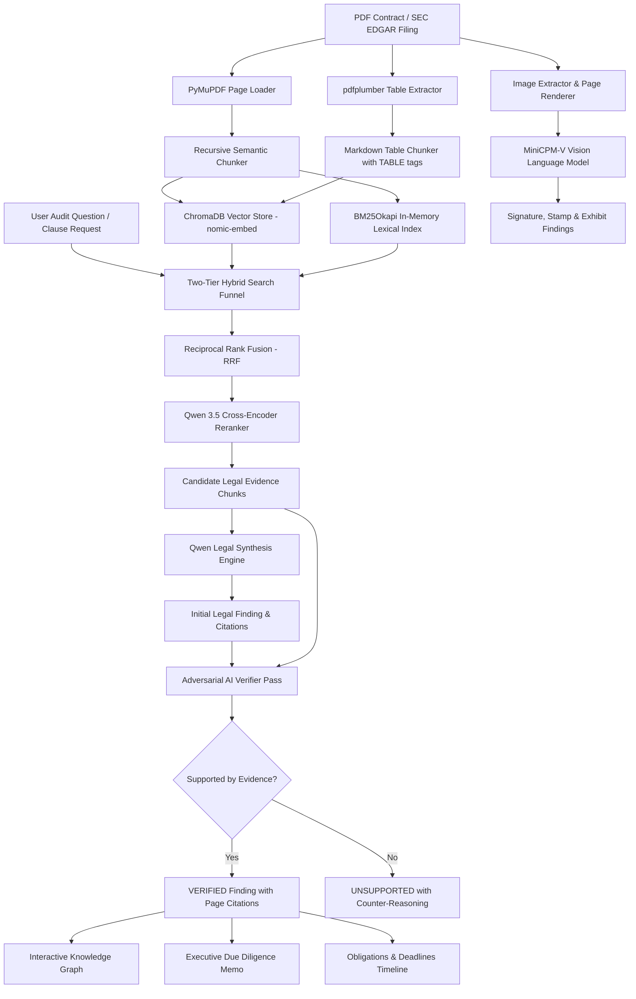

<p align="center">
  <h1 align="center">⚖️ Enterprise Auditor AI</h1>
  <p align="center"><strong>Next-Generation Autonomous Legal Intelligence, Multimodal Contract Auditing & Knowledge Graph Platform</strong></p>
</p>

<p align="center">
  <a href="https://www.python.org/downloads/"></a>
  <a href="https://fastapi.tiangolo.com"></a>
  <a href="https://streamlit.io"></a>
  <a href="https://ollama.ai"></a>
  <a href="https://render.com"></a>
  <a href="https://opensource.org/licenses/MIT"></a>
</p>

<p align="center">
  <a href="#-key-features">Features</a> •
  <a href="#-why-enterprise-auditor">Why Us</a> •
  <a href="#%EF%B8%8F-architecture--pipeline">Architecture</a> •
  <a href="#-tech-stack">Tech Stack</a> •
  <a href="#-quick-start">Quick Start</a> •
  <a href="#-deployment">Deployment</a> •
  <a href="#-project-structure">Structure</a>
</p>

---

## 📌 What is Enterprise Auditor?

**Enterprise Auditor AI** is an autonomous, privacy-first legal intelligence platform that can read, audit, and cross-examine hundreds of complex commercial contracts in seconds — and **never hallucinates**.

Upload any SEC EDGAR filing or corporate agreement, ask questions in plain English, and receive **verified legal findings** backed by exact page citations. A skeptical AI "counter-counsel" cross-examines every answer before it reaches you.

> 💡 **Think of it as**: An AI corporate lawyer + auditor + compliance officer on your laptop — with zero cloud data leakage and zero inference cost.

---

## ✨ Key Features

### 🔍 1. Hybrid Legal Q&A Engine
Ask complex legal questions across hundreds of contracts simultaneously. The engine combines **semantic vector search** (understanding meaning) with **exact keyword matching** (catching section numbers, party names, and legal codes) to find the most relevant evidence, then synthesizes a detailed legal finding with page-numbered citations.

### 🛡️ 2. Adversarial AI Verifier (Zero-Hallucination Guardrail)
Every generated answer is automatically cross-examined by an independent, skeptical AI verifier that reads **only** the cited source text. If the answer claims something the contract doesn't actually say — a date, a dollar amount, a party name — it gets flagged as `UNSUPPORTED` with detailed counter-reasoning. This is the **core differentiator** that makes Enterprise Auditor safe for real legal work.

### 👁️ 3. Multimodal Vision Intelligence (VLM)
Powered by **MiniCPM-V**, the system can visually inspect any contract page like human eyes:
- ✍️ Verify whether both parties **actually signed** the agreement
- 🔏 Detect **notary seals**, corporate stamps, and wet-ink signatures
- 📊 Read **scanned flowcharts**, clinical development diagrams, and engineering exhibits
- 🔎 Answer custom visual audit questions about any specific page

### 📊 4. Structured Table & Financial Schedule Extraction
Uses **pdfplumber** to extract multi-column pricing matrices, payment schedules, and fee grids into clean, structured tables — without mangling columns or numbers. Tables are tagged and indexed for precision retrieval during Q&A.

### 🕸️ 5. Interactive Knowledge Graph
Builds a force-directed network visualization connecting **Contracts → Clauses → Governing Laws → Risk Flags** across your entire portfolio. Features real-time physics simulation with draggable nodes, zoom/pan, and Graphviz DOT export.

### 📋 6. One-Click Due Diligence Memorandum
Generates a complete executive due diligence report covering:
- Executive Summary & Parties Identification
- Governance Structure & Jurisdiction Analysis
- Risk Assessment & Missing Safeguard Detection
- **Automated 0–100 Compliance Health Score**
- Downloadable markdown export for client deliverables

### ⏱️ 7. Obligations & Deadlines Timeline
Automatically extracts all post-execution timelines from contracts:
- `⏱️ 30 DAYS` — Notice periods for material breach
- `⏱️ 60 DAYS` — Cure periods and milestone delivery windows
- `⏱️ 90 DAYS` — Accounting review and audit covenants

### 📄 8. Clause Governance Suite
- **Clause Extraction**: Identifies and extracts 9 standard clause types (Termination, Indemnification, Liability, IP, Confidentiality, Governing Law, Assignment, Force Majeure, Non-Compete)
- **Clause Analysis**: Grades clause strength, identifies one-sided terms
- **Risk Detection**: Scans for dangerous provisions (unlimited liability, unilateral termination, broad IP assignment)
- **Missing Clause Detection**: Flags safeguards that should be present but aren't
- **Cross-Contract Comparison**: Compares equivalent clauses across different agreements

### 📥 9. Dynamic PDF Ingestion
Upload any custom PDF through the web UI — the system automatically extracts text, parses tables, generates embeddings, and updates all indexes in seconds without server restarts.

---

## 🥊 Why Enterprise Auditor?

### The Problem with Existing Tools

| Dimension | Generic Chatbots (ChatGPT/Claude) | Commercial CLMs (Ironclad/DocuSign) | Legal AI (Harvey/CoCounsel) | **Enterprise Auditor AI** |
| :--- | :---: | :---: | :---: | :---: |
| **Data Privacy** | ❌ Cloud API (3rd party) | ❌ Cloud Enterprise | ❌ Cloud (Azure/AWS) | ✅ **100% Local / Sovereign** |
| **Hallucination Defense** | ❌ None (blind generation) | ❌ None (rule-based) | ⚠️ Internal prompts | ✅ **Dedicated Adversarial Verifier** |
| **Vision Model (VLM)** | ⚠️ General vision | ❌ No vision | ⚠️ Limited OCR | ✅ **Native MiniCPM-V Audit** |
| **Table Parsing** | ❌ Unstructured text | ⚠️ OCR text | ⚠️ Markdown OCR | ✅ **pdfplumber Grid Extraction** |
| **Knowledge Graph** | ❌ None | ⚠️ Entity metadata | ⚠️ Vector relational | ✅ **Force-Directed Interactive Canvas** |
| **Due Diligence Memo** | ❌ Manual prompting | ⚠️ Template fill | ⚠️ LLM summary | ✅ **Auto 0–100 Health Score & Memo** |
| **Hosting Cost** | 💸 $20–$200/mo API bills | 💸 Enterprise licenses | 💸 $10k+ enterprise | 🆓 **Zero cost (local GPU)** |

### 4 Core Breakthroughs

1. **🛡️ Adversarial Double-Check**: Eliminates hallucination by automatically rejecting assertions not proven by evidence
2. **👁️ Multimodal Intelligence**: Bridges text and visuals — reads signatures, seals, and diagrams that text-only tools miss
3. **🔍 Hybrid Dense + Lexical Retrieval**: Pairs semantic understanding with exact keyword matching so nothing is missed
4. **🕸️ Relational Knowledge Graph**: Maps isolated PDFs into an interconnected entity network

---

## 🏗️ Architecture & Pipeline

### High-Level Flow

```
 📄 PDF Contract Uploaded
         │
         ├──▶ 1. INGESTION
         │       • PyMuPDF extracts text with page tracking
         │       • pdfplumber extracts tables into [TABLE] markdown grids
         │       • Page renderer creates 150 DPI images for VLM
         │
         ├──▶ 2. INDEXING
         │       • nomic-embed-text → 768-dim vectors → ChromaDB
         │       • BM25Okapi tokenized inverted index (in-memory)
         │
         ▼
 🔍 User Asks a Legal Question
         │
         ├──▶ 3. HYBRID SEARCH
         │       • Dense semantic search (ChromaDB, top 15)
         │       • Sparse keyword search (BM25, top 15)
         │       • Reciprocal Rank Fusion merges both rankings
         │
         ├──▶ 4. RERANKING
         │       • Qwen 3.5 cross-encoder scores top 8 candidates
         │
         ├──▶ 5. LEGAL SYNTHESIS
         │       • Qwen generates finding with [Evidence 1], [Evidence 2] citations
         │
         ▼
 🛡️ ADVERSARIAL VERIFICATION
         │
         ├──▶ 6. SKEPTICAL AUDIT
         │       • Verifier reads ONLY the cited source chunks
         │       • Every claim checked against raw text
         │       • SUPPORTED ✅  or  UNSUPPORTED ⚠️ with reasoning
         │
         ▼
 📊 OUTPUTS
         │
         ├──▶ 7. MiniCPM-V Vision — Signature/seal/exhibit audit
         ├──▶ 8. Knowledge Graph — Interactive entity network
         ├──▶ 9. Due Diligence Memo — Executive report + Health Score
         └──▶ 10. Obligations Timeline — Deadlines & notice periods
```

### Detailed Mermaid Diagram



---

## 🔧 Tech Stack

| Layer | Technology | Purpose |
| :--- | :--- | :--- |
| **LLM** | Qwen 3.5 4B (via Ollama) | Legal synthesis, reranking, clause analysis |
| **VLM** | MiniCPM-V 2.6 (via Ollama) | Signature verification, visual document audit |
| **Embeddings** | nomic-embed-text (768-dim) | Dense semantic vector representations |
| **Vector DB** | ChromaDB | Persistent vector storage & similarity search |
| **Lexical Search** | rank-bm25 (BM25Okapi) | Exact keyword & section number matching |
| **PDF Text** | PyMuPDF (fitz) | Text extraction with page tracking |
| **PDF Tables** | pdfplumber | Structured table & financial grid extraction |
| **Backend** | FastAPI + Uvicorn | REST API with async request handling |
| **Web UI** | Vanilla JS + HTML5 Canvas | Executive dashboard with glassmorphism design |
| **Dashboards** | Streamlit, Gradio 5.x | Python-native interactive dashboards |
| **Containers** | Docker + Docker Compose | GPU-accelerated containerized deployment |
| **Deployment** | Render, Hugging Face Spaces | Cloud hosting with auto-deploy from GitHub |

---

## 🚀 Quick Start

### Prerequisites

- **Python 3.11+**
- **[Ollama](https://ollama.ai)** installed and running

### 1. Clone & Install

```bash
git clone https://github.com/THEsoham/enterprise-auditor.git
cd enterprise-auditor

# Create virtual environment
python -m venv .venv

# Activate it
# Linux/macOS:
source .venv/bin/activate
# Windows:
.venv\Scripts\activate

# Install dependencies
pip install -r requirements.txt
```

### 2. Pull Required Models

```bash
ollama pull qwen3.5:4b          # Legal reasoning & synthesis
ollama pull nomic-embed-text     # Semantic embeddings
ollama pull minicpm-v            # Vision model for signatures & exhibits
```

### 3. Run the Application

#### Option A: Executive Web Dashboard (FastAPI) — *Recommended*
```bash
python -m uvicorn server:app --host 127.0.0.1 --port 8000
```
Open **http://localhost:8000** in your browser.

#### Option B: Streamlit Pro Suite
```bash
streamlit run streamlit_app.py
```
Open **http://localhost:8501** in your browser.

#### Option C: Interactive Terminal CLI
```bash
python main.py
```
Use commands: `ask`, `clause`, `risk`, `missing`, `compare`, `verify`, `graph`, `eval`.

---

## 🌐 Deployment

### Render (Live) ✅

The app is deployed on **Render** with automatic GitHub integration:

> 🔗 **Live URL**: Deployed via [render.com](https://render.com) from the `main` branch

**Configuration** (already set in [`render.yaml`](render.yaml)):
- **Runtime**: Python 3 / Docker
- **Build Command**: `pip install -r requirements.txt`
- **Start Command**: `python -m uvicorn server:app --host 0.0.0.0 --port $PORT`

### Hugging Face Spaces

```bash
# Already configured at:
# https://huggingface.co/spaces/dilutionalSOHAM/enterprise-auditor
```

### Docker (Self-Hosted GPU Server)

```bash
# Build and run with GPU passthrough
docker compose up -d --build

# Access at http://localhost:8000
```

---

## 📁 Project Structure

```
enterprise-auditor/
├── server.py                  # FastAPI backend (REST API + static file serving)
├── streamlit_app.py           # Streamlit Pro Suite dashboard
├── app.py                     # Gradio interface (Hugging Face Spaces)
├── main.py                    # Interactive terminal CLI
│
├── auditor_core/              # Core Python package
│   ├── ingestion/             # PDF text, table, and image extraction
│   │   ├── ingest_single.py   # Single PDF upload & processing pipeline
│   │   ├── table_extractor.py # pdfplumber structured table extraction
│   │   └── image_extractor.py # Image extraction & page rendering
│   ├── chunking/              # Recursive semantic text chunking
│   ├── embeddings/            # ChromaDB vector store (nomic-embed-text)
│   ├── retrieval/             # Hybrid search, BM25, reranking, QA engine
│   │   ├── hybrid.py          # Dense + sparse fusion with RRF
│   │   ├── keyword_index.py   # BM25Okapi lexical index
│   │   ├── reranker.py        # Qwen cross-encoder reranker
│   │   └── qa_engine.py       # Legal question-answering synthesis
│   ├── models/                # AI analysis modules
│   │   ├── clause_extractor.py    # 9-type clause identification
│   │   ├── clause_analyzer.py     # Clause strength grading
│   │   ├── risk_detector.py       # Dangerous provision scanner
│   │   ├── missing_clause.py      # Missing safeguard detector
│   │   ├── comparator.py          # Cross-contract clause comparison
│   │   ├── vlm_analyzer.py        # MiniCPM-V vision intelligence
│   │   ├── report_generator.py    # Due diligence memo generator
│   │   └── obligation_extractor.py # Deadline & timeline extraction
│   ├── verification/          # Adversarial AI verifier
│   │   └── verifier.py        # Skeptical cross-examination engine
│   ├── graph/                 # Knowledge graph builder
│   │   └── knowledge_graph.py # Entity-relationship extraction & DOT export
│   ├── evaluation/            # Benchmark evaluation suite
│   └── config/                # Configuration & constants
│
├── web/                       # Frontend assets
│   ├── index.html             # Executive dashboard UI
│   ├── app.js                 # Canvas knowledge graph + API integration
│   └── style.css              # Glassmorphism design tokens
│
├── data/                      # Contract datasets & ChromaDB storage
│   ├── datasets/              # SEC EDGAR CUAD contract PDFs
│   └── chroma/                # Persistent vector database
│
├── requirements.txt           # Python dependencies
├── Dockerfile                 # Container build specification
├── docker-compose.yml         # Multi-container GPU stack
├── render.yaml                # Render deployment blueprint
└── ARCHITECTURE_AND_FEATURES.md  # Full technical whitepaper
```

---

## 📊 Business Impact

| Metric | Impact |
| :--- | :--- |
| **Due Diligence Time** | **~80% reduction** — instant extraction across 250+ contracts |
| **Hallucination Risk** | **Eliminated** — adversarial verification catches every ungrounded claim |
| **Data Privacy** | **100% sovereign** — zero exposure to third-party cloud APIs |
| **Inference Cost** | **$0** — all models run locally on your GPU |
| **Contract Coverage** | **250+ SEC EDGAR filings** pre-indexed, unlimited custom uploads |

---

## 🧪 Recommended Test Contract

For the best demo showcasing **all features**, use:

> 📄 **`RitterPharmaceuticalsInc_20200313_S-4A_EX-10.54_12055220_EX-10.54_Development Agreement.pdf`**

This contract contains rich clause structures, financial schedules, workflow diagrams, signature blocks, and operational timelines — perfect for testing every capability.

---

## 📄 License

This project is licensed under the **MIT License** — see the [LICENSE](LICENSE) file for details.

---

<p align="center">
  <strong>Built with ❤️ by <a href="https://github.com/THEsoham">Soham</a></strong>
</p>
